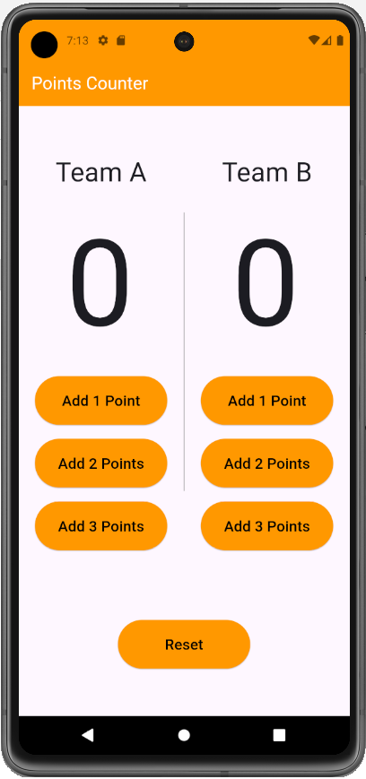
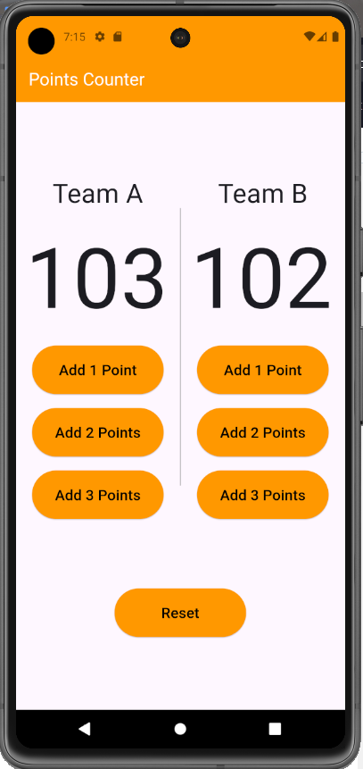

# Points Counter App

A responsive Flutter application designed to keep track of team points dynamically, with a clean user interface and scalable design for various screen sizes. This app is ideal for games, sports, and any team-based activities requiring point management.

## Table of Contents

- [Features](#features)
- [Demo](#demo)
- [Getting Started](#getting-started)
- [Project Structure](#project-structure)
- [Usage](#usage)
- [Technical Details](#technical-details)
- [Dependencies](#dependencies)
- [Contributing](#contributing)
- [License](#license)
- [Contact](#contact)

## Features

- **Dynamic Point Tracking**: Add points to either team in increments of 1, 2, or 3. Real-time updates are displayed using responsive, auto-sizing text.
- **Auto-Size Text Fields**: Utilizes `auto_size_text_field` to dynamically scale text for various screen sizes.
- **Reset Functionality**: Reset both teams’ points with a single button click.
- **Responsive Design**: Adjusts font sizes and button dimensions based on screen width and height.
- **Intuitive UI**: Clean and organized interface, suitable for quick interactions.

## Demo

Here are screenshots of the app in action:





## Getting Started

Follow these steps to set up and run the app locally.

### Prerequisites

- **Flutter SDK**: Ensure Flutter is installed. Follow the official installation guide [here](https://flutter.dev/docs/get-started/install).
- **Dart SDK**: Included with Flutter.
- **IDE**: VSCode, Android Studio, or any code editor supporting Flutter.

### Installation

1. **Clone the repository**:
   ```bash
   git clone https://github.com/NadaAlaa1/points-counter.git
   cd points-counter
   
2. **Install dependencies**:
   ```bash
   flutter pub get
   
3. **Run the app**:
   ```bash
   flutter run

## Project Structure

The core files are organized as follows:

```plaintext
points_counter/
├── lib/
│   ├── main.dart         # Main entry file with UI and app logic
├── pubspec.yaml          # Project dependencies and metadata
└── README.md             # Project documentation

### Key Components

- `main.dart`: Contains the `PointsCounter` class, which builds the app's UI with two sections for each team. The `_buildPointButton` helper function creates buttons to add points, and `AutoSizeTextField` dynamically displays points.

## Usage

1. **Add Points**: Tap the buttons for either **Team A** or **Team B** to add 1, 2, or 3 points.
2. **Reset Points**: Tap the "Reset" button at the bottom of the screen to reset both teams’ scores to zero.

## Technical Details

### Responsive Design

The app uses `MediaQuery` to adapt button sizes, text sizes, and layout to various screen dimensions. This ensures a seamless user experience across devices, from small smartphones to larger tablets.

### State Management

State management in this app is straightforward, using `StatefulWidget` to manage points for both teams. `setState` is called whenever points are modified, ensuring the UI reflects the latest score immediately.

### Auto-Size Text Field

The `AutoSizeTextField` widget provides dynamic font resizing for the score display, automatically adjusting based on available space. This is particularly useful for adapting to various screen sizes and orientations.

## Dependencies

The app relies on the following Flutter package:

- `auto_size_text_field`: Provides the auto-sizing text field feature for the points display.

To add any new dependencies, update the `pubspec.yaml` file and run `flutter pub get`.

## Contributing

Contributions are welcome! To contribute:

1. **Fork the repository**.

2. **Create a new branch** for your feature:
   ```bash
   git checkout -b feature/your-feature-name

3. **Make your changes** and commit them:
   ```bash
   git commit -m 'Add feature'

4. **Push to the branch**:
   ```bash
   git push origin feature/your-feature-name

5. **Create a Pull Request** explaining your changes
